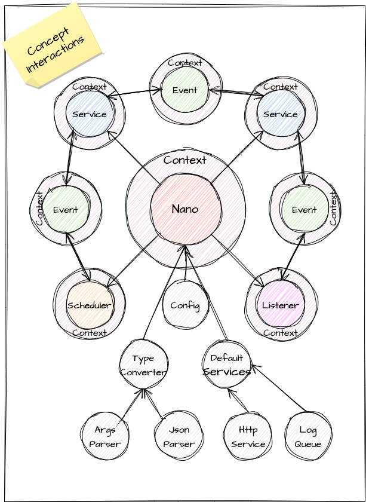

# 🧬 Nano Framework

_(under construction)_

[//]: # ([![Build][build_shield]][build_link])

[//]: # ([![Maintainable][maintainable_shield]][maintainable_link])

[//]: # ([![Coverage][coverage_shield]][coverage_link])
[![Issues][issues_shield]][issues_link]
[![Commit][commit_shield]][commit_link]
[![License][license_shield]][license_link]
[![Central][central_shield]][central_link]
[![Tag][tag_shield]][tag_link]
[![Javadoc][javadoc_shield]][javadoc_link]
[![Size][size_shield]][size_shield]
![Label][label_shield]
![Label][java_version]

## 🚀 Elevate Your Java Experience

Welcome to **Nano Framework**, where simplicity meets power in Java development. Nano is designed for developers who
value a **lightweight**, **efficient**, and **straightforward** approach to building applications. It's the essence of
modern Java, stripped of complexity and enriched with functionality.

## 📐 Concept



## 🧭 Navigation

* 📐 [Concept](#-concept)
* 🔖 [Philosophy](#-philosophy-back-to-basics)
* 🤔 [Why Nano](#-why-nano-the-nano-advantage)
* ✨ [Benefits](#-benefits-of-nano)
* 📚 [Getting Started](#-getting-started)
* 🔬 [Examples](#-examples)
    * [Start Nano](#start-nano)
    * [Configuration](#configurations)
    * [Logger](#logger)
    * [Events](#events)
    * [Services](#services)
    * [Listeners](#listeners)
    * [Schedulers](#schedulers)
    * [Context](#context)
    * [HttpService](#httpservice)
    * 🔗 [Json](https://github.com/YunaBraska/type-map#json)
    * 🔗 [TypeConverter](https://github.com/YunaBraska/type-map#typeconverter)
* 🧩[Integrations](#integrations)
    * 🌱 [Spring Boot](#-Nano-in-Spring-boot)
    * 🧑‍🚀 [Micronaut](#-Nano-in-micronaut)
    * 🐸 [Quarkus](#-Nano-in-quarkus)
* 🤝 [Contributing](#-contributing)
* 📜 [License](#-license)
* 🙋‍ [Support](#-support)
* 🌐 [Stay connected](#-stay-connected)

## 🔖 Philosophy: Back to Basics

Nano was born from the desire to simplify Java development. It's about going back to basics and harnessing the power of
Java without the baggage of heavy frameworks. Nano is for those who believe in keeping things simple, efficient, and
sustainable.

## 🤔 Why Nano? The Nano Advantage

Serverless & Container Ready: Tailored for modern deployment environments.
Small & Performant: Ideal for resource-constrained environments.
Security Conscious: Minimized attack surface due to few dependencies.
Clear & Cohesive: No scattered logic, everything in its right place.
Eco-Friendly Development: Less resource usage means lower costs and energy consumption.

## 📚 Getting Started

To get started with Nano, simply include it in your Java project. You can build it from the source or include it as a
dependency in your build management tool.

Maven example

```xml

<dependency>
    <groupId>berlin.yuna</groupId>
    <artifactId>nano</artifactId>
    <version>1.0.0</version>
</dependency>
```

Gradle example

```groovy
dependencies {
    implementation 'berlin.yuna:nano:1.0.0'
}
```

This snippet showcases the creation of a Nano application, service registration, asynchronous task execution, and event
handling.

## ✨ Benefits of Nano:

* 🧩 **Modular Design**: Nano's architecture is modular, making it easy to understand, extend, and maintain.
* 🧵 **Concurrency Management**: Efficiently handle asynchronous tasks using advanced thread management.
* 📡 **Event-Driven Architecture**: Robust event handling that simplifies communication between different parts of your
  application.
* ⚙️ **Flexible Configuration**: Configure your application using environment variables, system properties, or
  command-line
  arguments.
* 📊 **Robust Logging and Error Handling**: Integrated logging and comprehensive error handling mechanisms for reliable
  operation.
* 🚀 **Scalable and Performant**: Designed with scalability and performance in mind to handle high-concurrency scenarios.
* 🪶 **Lightweight & Fast**: Starts in milliseconds, uses ~10MB memory.
* 🌿 **Pure Java, Pure Simplicity**: No reflections, no regex, no unnecessary magic.
* ⚡ **GraalVM Ready**: For ahead-of-time compilation and faster startup.
* 🔒 **Minimal Dependencies**: Reduces CVE risks and simplifies updates.
* 🌊 **Fluent & Stateless**: Intuitive API design for easy readability and maintenance.
* 🛠️ **Rapid Service Development**: Build real services in minutes.

# TODO: complete following:

## 🔬 Examples

Check out various examples demonstrating different capabilities of Nano here.

### Build Nano

add the native-image profile to your `pom.xml` and run `mvn package -Pnative-image`

```xml

<profiles>
    <!-- NATIVE COMPILATION -->
    <profile>
        <id>native-image</id>
        <build>
            <plugins>
                <plugin>
                    <groupId>org.graalvm.nativeimage</groupId>
                    <artifactId>native-image-maven-plugin</artifactId>
                    <version>21.2.0</version>
                    <configuration>
                        <imageName>ExampleApp</imageName>
                        <mainClass>de.yuna.berlin.nativeapp.helper.ExampleApp</mainClass>
                        <buildArgs>
                            <!-- Reduces the image size - Ensures the native image doesn't include the JVM as a fallback option -->
                            <buildArg>--no-fallback</buildArg>
                            <!-- Disables the use of the GraalVM compilation server -->
                            <buildArg>--no-server</buildArg>
                            <!-- Improve startup time - Initialize classes at build time rather than at runtime -->
                            <buildArg>--initialize-at-build-time</buildArg>
                            <!-- Include all files under /resources -->
                            <buildArg>-H:IncludeResources=resources/config/.*</buildArg>
                        </buildArgs>
                    </configuration>
                    <executions>
                        <execution>
                            <goals>
                                <goal>native-image</goal>
                            </goals>
                            <phase>package</phase>
                        </execution>
                    </executions>
                </plugin>
            </plugins>
        </build>
    </profile>
</profiles>
```

### Start Nano

* Step 1: start [Nano](src/main/java/de/yuna/berlin/nativeapp/core/Nano.java) `final Nano nano = new Nano();`
* Step 2: create
  a [Context](src/main/java/de/yuna/berlin/nativeapp/core/model/Context.java) `final Context context = nano.newContext(ExampleApp.class);` (
  each context creates its own
  logger and trace id)
* Step 3: use nano
    * Logging: `context.logger().info(() -> "My info log");`
    * Scheduling: `context.schedule(() ->System.out.println("Schedule once after 100 ms"), 100,MILLISECONDS);`
    * Sending events: `context.sendEvent(MY_EVENT, myPayloadObject);`
    * Receiving Events: `context.addEventListener(EVENT_APP_HEARTBEAT, () -> System.out.println("Heartbeat received"));`
    * Receiving config values: `context.getOpt(LogLevel.class, "nano.log.level").orElse(LogLevel.INFO);`
    * [...]

### Configurations

See also [default configs](src/main/java/de/yuna/berlin/nativeapp/core/model/Config.java)

Configuration in Nano is designed to be straightforward and intuitive, empowering developers to tailor the framework to
their specific needs with minimal effort. Nano leverages a simple key-value pairing system, allowing configurations to
be easily defined, read, and modified. This approach ensures that your application behaves exactly as intended, with
configurations that can adapt to various environments and use cases.

1) Properties File: Store configuration in .properties files, which can be loaded at runtime.
2) Environment Variables: Utilize environment variables for configurations, ideal for containerized applications.
3) Command Line Arguments: Pass configuration directly as command-line arguments when starting your application.

* DSL config: `nano.config().set("nano.log.level", "INFO");`
* Receiving a config
  value: `LogLevel logLevel = context.getOpt(LogLevel.class, "nano.log.level").orElse(LogLevel.INFO);`

### Logger

Logging in Nano is designed to be intuitive, lightweight, and efficient, ensuring developers have a clear and
straightforward way to monitor and debug their applications. Emphasizing simplicity, Nano's logging mechanism integrates
seamlessly within the framework, providing a hassle-free experience for capturing important runtime information.

* `context.logger().info(() -> "Processing something important");`
* `context.logger().error(e, () -> "Error processing request");`

logging [console](src/main/java/de/yuna/berlin/nativeapp/helper/logger/logic/LogFormatterConsole.java) / [json](src/main/java/de/yuna/berlin/nativeapp/helper/logger/logic/LogFormatterJson.java)

* [NanoLogger](src/main/java/de/yuna/berlin/nativeapp/helper/logger/logic/NanoLogger.java)
* [LogQueue](src/main/java/de/yuna/berlin/nativeapp/helper/logger/logic/LogQueue.java)
* [LogLevel](src/main/java/de/yuna/berlin/nativeapp/helper/logger/model/LogLevel.java)

### Events

Events are the backbone of communication within the Nano Framework, facilitating a seamless and decoupled interaction
between different parts of an application. By adopting an event-driven architecture, Nano enables services and
components to react to changes or actions without needing to directly reference each other, promoting flexibility and
scalability.

* `context.sendEvent(MyEventId, myPayloadObject);`

* [Event](src/main/java/de/yuna/berlin/nativeapp/helper/event/model/Event.java)
* [Predefined Event](src/main/java/de/yuna/berlin/nativeapp/helper/event/model/EventType.java)
* [EventTypeRegister](src/main/java/de/yuna/berlin/nativeapp/helper/event/EventTypeRegister.java)

### Schedulers

[Scheduler](src/main/java/de/yuna/berlin/nativeapp/core/model/Scheduler.java) within
the [Nano](src/main/java/de/yuna/berlin/nativeapp/core/Nano.java) Framework play a crucial role in orchestrating
asynchronous tasks and operations, enabling precise timing and execution of code blocks based on specific timing
strategies. These utilities are designed to facilitate time-based task management, allowing developers to schedule
one-off or recurring tasks with ease.

_(methods will be added soon to the `Context` as well)_

* `nano.schedule(() ->System.out.println("Schedule once after 100 ms"), 100,MILLISECONDS)`
* `nano.schedule(() ->System.outprintln("Schedule endless every 256 ms after 100 ms"), 100,256,MILLISECONDS,()->false);`

### Listeners

Listeners within the Nano Framework are designed to embody the essence of simplicity and functionality, serving as a
powerful mechanism for reacting to events without the overhead of creating full-fledged services. They are a key
component in [Nano](src/main/java/de/yuna/berlin/nativeapp/core/Nano.java)'s event-driven architecture, enabling
developers to write clean, modular, and maintainable code by
focusing on event responses rather than the intricacies of service management.

* `context.addEventListener(EVENT_APP_HEARTBEAT, () -> System.out.println("Heartbeat received"));`

### Services

[Services](src/main/java/de/yuna/berlin/nativeapp/core/model/Service.java) within
the [Nano](src/main/java/de/yuna/berlin/nativeapp/core/Nano.java) Framework embody the essence
of modularity and flexibility, functioning as standalone entities that seamlessly integrate into the core ecosystem.
Designed to be primarily event-driven, [services](src/main/java/de/yuna/berlin/nativeapp/core/model/Service.java)
respond dynamically to incoming events and can dispatch their own, fostering a highly reactive and interconnected
environment. This design principle ensures that
each [service](src/main/java/de/yuna/berlin/nativeapp/core/model/Service.java), while autonomous, contributes to the
collective functionality of the application, promoting loose coupling and high cohesion.

Nano comes with pre-equipped services:

* [HttpService](src/main/java/de/yuna/berlin/nativeapp/services/http/HttpService.java): A built-in service that
  simplifies the process of handling HTTP requests. By abstracting the underlying
  complexities, it allows developers to focus on implementing business logic rather than dealing with boilerplate code
  associated with server communication.
* [MetricService](src/main/java/de/yuna/berlin/nativeapp/services/metric/logic/MetricService.java): This service
  provides an out-of-the-box solution for monitoring and recording application metrics.
  Whether it's tracking the number of active threads, memory usage, or custom application-specific metrics, the
  MetricService offers a streamlined approach to gather insightful data about your application's performance.

### Context

The [Context](src/main/java/de/yuna/berlin/nativeapp/core/model/Context.java)
in [Nano](src/main/java/de/yuna/berlin/nativeapp/core/Nano.java) Framework is like having a personal assistant by your
side while you navigate through the development of your application. It's designed to simplify your interaction with
Nano's core functionalities, ensuring you have everything you need within arm's reach. At its core, the Context serves
three primary roles: managing logging, tracing, and holding configurations. Think of it as a mini-orchestrator for your
application, streamlining the way you work with Nano's ecosystem.

* Tracing e.g. `context.traceId()`, `context.traceIds()`
* Logging e.g. `context.logger().info(() -> "My info log")`, `context.logger().error(exception, () -> "My error log")`
* Events e.g. `context.sendEvent(MY_EVENT, myPayloadObject)`
* Schedulers e.g. `nano.schedule(() ->System.out.println("Schedule once after 100 ms"), 100,MILLISECONDS)`

### HttpService

_(under construction)_

* [HttpService](src/main/java/de/yuna/berlin/nativeapp/services/http/HttpService.java)

## Integrations

### 🌱 Nano in Spring boot

* Run Nano as Bean

```java

@Configuration
public class NanoConfiguration {

    @Bean
    public Nano nanoInstance() {
        // Initialize your Nano instance with the desired services
        return new Nano(); // Optionally add your services and configurations here
    }
}
```

* Use Nano in a Service

```java

@Service
public class SomeService {

    private final Nano nano;

    @Autowired
    public SomeService(final Nano nano) {
        this.nano = nano;
        // Use Nano instance as needed
    }
}
```

* Graceful shutdown using `DisposableBean`

Nano has a graceful shutdown by itself, but it could be useful to trigger it from a Spring bean.

```java

@Component
public class NanoManager implements DisposableBean {

    private final Nano nano;

    public NanoManager(final Nano nano) {
        this.nano = nano;
    }

    @Override
    public void destroy() {
        nano.stop(); // Trigger Nano's shutdown process
    }
}
```

* Graceful shutdown using `@PreDestroy` annotation

Nano has a graceful shutdown by itself, but it could be useful to trigger it from a Spring bean.

```java

@Component
public class NanoManager {

    private final Nano nano;

    public NanoManager(final Nano nano) {
        this.nano = nano;
    }

    @PreDestroy
    public void onDestroy() {
        nano.stop(); // Trigger Nano's shutdown process
    }
}
```

### 🧑‍🚀 Nano in Micronaut

* Define the Nano Bean

```java

@Factory
public class NanoFactory {

    @Singleton
    public Nano nanoInstance() {
        // Initialize your Nano instance with desired services
        return new Nano(); // Optionally add services and configurations here
    }
}
```

* Use Nano in Your Application

```java

@Singleton
public class SomeService {

    private final Nano nano;

    public SomeService(final Nano nano) {
        this.nano = nano;
        // Use the Nano instance as needed
    }
}
```

* Graceful shutdown using `@ServerShutdownEvent`

```java

@Singleton
public class NanoManager implements ApplicationEventListener<ServerShutdownEvent> {

    private final Nano nano;

    public NanoManager(final Nano nano) {
        this.nano = nano;
    }

    @Override
    public void onApplicationEvent(final ServerShutdownEvent event) {
        nano.stop(); // Trigger Nano's shutdown process
    }
}
```

### 🐸 Nano in Quarkus

* Define the Nano Producer

```java

@ApplicationScoped
public class NanoProducer {

    @Produces
    public Nano produceNano() {
        // Initialize your Nano instance with the desired services
        return new Nano(); // Optionally add your services and configurations here
    }
}
```

* Once you've defined your Nano producer, you can inject the Nano instance into any Quarkus bean using CDI (Contexts and
  Dependency Injection).

```java

@ApplicationScoped
public class BusinessLogicService {

    @Inject
    Nano nano;

    public void performAction() {
        // Use the Nano instance for your business logic
    }
}
```

* Graceful shutdown using `@Destroyed`

Nano has a graceful shutdown by itself, but it could be useful to trigger it from a quarkus.

```java

@ApplicationScoped
public class ShutdownListener {

    @Inject
    Nano nano;

    public void onShutdown(@Observes @Destroyed(ApplicationScoped.class) final Object init) {
        nano.stop(); // Trigger Nano's shutdown process
    }
}
```

## 🤝 Contributing

Contributions to Nano are welcome! Please refer to our [Contribution Guidelines](CONTRIBUTING.md) for more information.

## 📜 License

Nano is open-source software licensed under the [Apache license](LICENSE).

## 🙋‍ Support

If you encounter any issues or have questions, please file an
issue [here](https://github.com/YunaBraska/nano/issues/new/choose).

## 🌐 Stay Connected

* [GitHub](https://github.com/YunaBraska)
* [X (aka Twitter)](https://twitter.com/YunaMorgenstern)
* [Mastodon](https://hachyderm.io/@LunaFreyja)
* [LinkedIn](https://www.linkedin.com/in/yuna-morgenstern-6662a5145/)


[build_shield]: https://github.com/YunaBraska/nano/workflows/MVN_RELEASE/badge.svg

[build_link]: https://github.com/YunaBraska/nano/actions?query=workflow%3AMVN_RELEASE

[maintainable_shield]: https://img.shields.io/codeclimate/maintainability/YunaBraska/nano?style=flat-square

[maintainable_link]: https://codeclimate.com/github/YunaBraska/nano/maintainability

[coverage_shield]: https://img.shields.io/codeclimate/coverage/YunaBraska/nano?style=flat-square

[coverage_link]: https://codeclimate.com/github/YunaBraska/nano/test_coverage

[issues_shield]: https://img.shields.io/github/issues/YunaBraska/nano?style=flat-square

[issues_link]: https://github.com/YunaBraska/nano/issues/new/choose

[commit_shield]: https://img.shields.io/github/last-commit/YunaBraska/nano?style=flat-square

[commit_link]: https://github.com/YunaBraska/nano/commits/main

[license_shield]: https://img.shields.io/github/license/YunaBraska/nano?style=flat-square

[license_link]: https://github.com/YunaBraska/nano/blob/main/LICENSE

[dependency_shield]: https://img.shields.io/librariesio/github/YunaBraska/nano?style=flat-square

[dependency_link]: https://libraries.io/github/YunaBraska/nano

[central_shield]: https://img.shields.io/maven-central/v/berlin.yuna/nano?style=flat-square

[central_link]:https://search.maven.org/artifact/berlin.yuna/nano

[tag_shield]: https://img.shields.io/github/v/tag/YunaBraska/nano?style=flat-square

[tag_link]: https://github.com/YunaBraska/nano/releases

[javadoc_shield]: https://javadoc.io/badge2/berlin.yuna/nano/javadoc.svg?style=flat-square

[javadoc_link]: https://javadoc.io/doc/berlin.yuna/nano

[size_shield]: https://img.shields.io/github/repo-size/YunaBraska/nano?style=flat-square

[label_shield]: https://img.shields.io/badge/Yuna-QueenInside-blueviolet?style=flat-square

[gitter_shield]: https://img.shields.io/gitter/room/YunaBraska/nano?style=flat-square

[gitter_link]: https://gitter.im/nano/Lobby

[java_version]: https://img.shields.io/badge/java-21-blueviolet?style=flat-square
