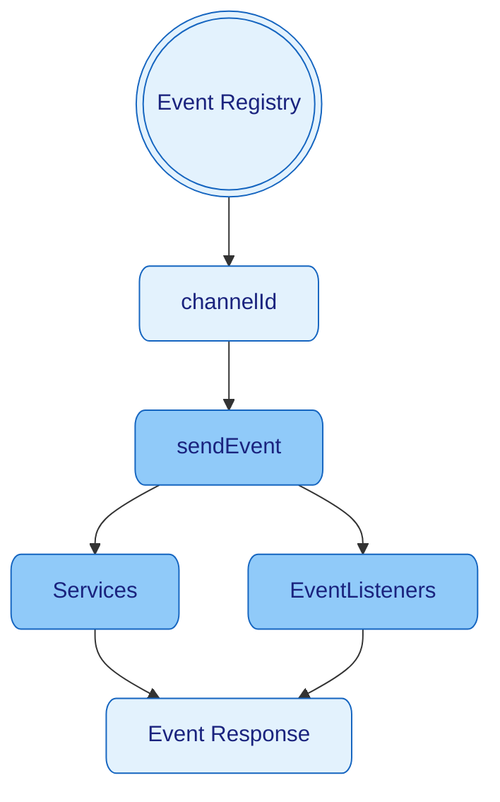

[Home](../../README.md) / [Components](../../README.md#-components)

 [Context](../context/README.md)
| [**> Events <**](README.md)
| [Logger](../logger/README.md)
| [Schedulers](../schedulers/README.md)
| [Services](../services/README.md)

# Events

[Events](../events/README.md) are the backbone of communication within the Nano Framework, to decoupled interaction between different parts of
an application.
They are a core API concept for using [Services](../services/README.md).
See [Event.java](../../src/main/java/berlin/yuna/nano/helper/event/model/Event.java)

## ChannelIds

`ChannelIds` are globally, unique IDs to identify the right channel to send events into,
They can be registered once with `ChannelIdRegister.registerChannelId("MY_EVENT_NAME");` -
see [EventChanelRegister.java](../../src/main/java/berlin/yuna/nano/helper/event/EventChannelRegister.java)
and [DefaultEventChannel](../../src/main/java/berlin/yuna/nano/helper/event/model/EventChannel.java)

## Sending Events

[Events](../events/README.md) can be sent **synchronous**, **asynchronous**, **single cast** or **broadcast**.

* synchronous (SingleCast)
  * `context.sendEvent(channelId, MyPayloadObject)`
  * `sendEventReturn()` will return the Event instead of the Context
* asynchronous (SingleCast)
  * `context.sendEvent(channelId, MyPayloadObject, response -> myListener)`
  * `sendEventReturn()` will return the Event instead of the Context

* synchronous (BroadCast)
  * `context.broadcastEvent(channelId, MyPayloadObject)`
  * `broadcastEventReturn()` will return the Event instead of the Context
  * _broadcast will not stop at the first responding listeners_
* asynchronous (BroadCast)
  * `context.broadcastEvent(channelId, MyPayloadObject, response -> myListener)`
  * `broadcastEventReturn()` will return the Event instead of the Context
  * _broadcast will not stop at the first responding listeners_

# Listening to Events

Listeners can be easily registered with `context.subscribeEvent(channelId, event -> System.out.println(event))`.
[Services](../services/README.md)  don't need to subscribe or unsubscribe to [Events](../events/README.md) as they are
managed and receive the
[Events](../events/README.md) through the build
in method `onEvent`

