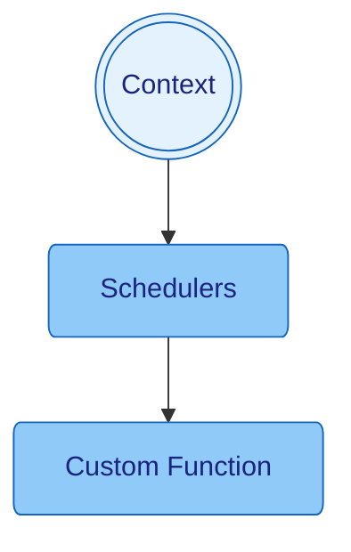

[Home](../../README.md) / [Components](../../README.md#-components)

 [Context](../context/README.md)
| [Events](../events/README.md)
| [Logger](../logger/README.md)
| [**> Schedulers <**](README.md)
| [Services](../services/README.md)

# Schedulers

[Schedulers](../schedulers/README.md) are managed functions which run in the background.

## Examples

* `context.run(() -> System.out.println("Scheduled"), 128, MILLISECONDS)` - Run a lambda on a [Schedulers](../schedulers/README.md) with a 128ms delay
* `context.run(() -> System.out.println("Scheduled"), 128, 256, MILLISECONDS)` - Run a lambda on a [Schedulers](../schedulers/README.md) with a 128ms delay and 256ms period

## Stop Services

