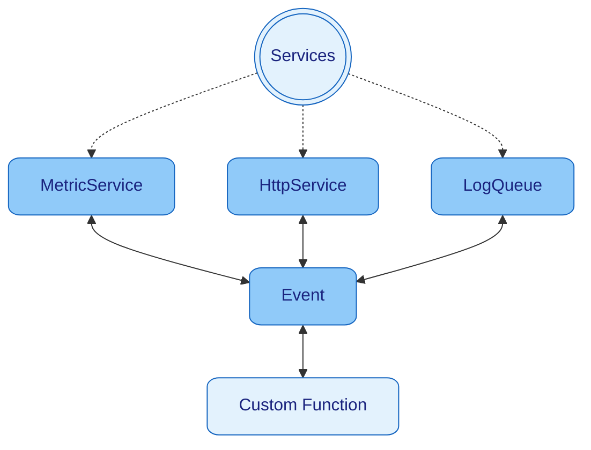

[Home](../../README.md)
| [Context](../context/README.md)
| [Events](../events/README.md)
| [Logger](../logger/README.md)
| [Schedulers](../schedulers/README.md)
| [**> Services <**](README.md)

# Services

[Services](../services/README.md) are extensions for Nano which are independent managed programs that are running in the
background.
They are usually designed to be accessed by [Events](../events/README.md).
Nano has default [Services](../services/README.md) like `HttpService`, `MetricService`, `LogQueue`

## Start Services

* `new Nano(new HttpService(), new MetricService(), new LogQueue())` - [Services](../services/README.md) will start with
  Nano Startup
* `context.run(new HttpService())` - Service start

## Stop Services

