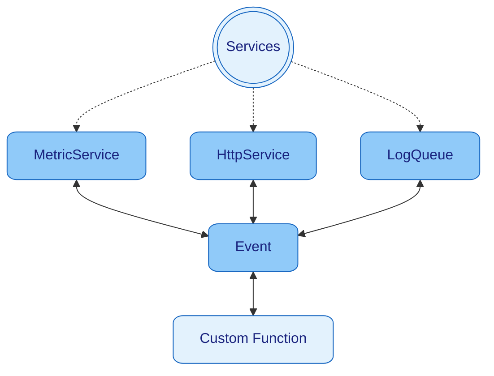

> [Home](../../../README.md)
> / [Components](../../../README.md#-components)
> / [Services](../../services/README.md)
> / [**HttpService**](README.md)

* [Usage](#usage)
  * [Start Http Service](#start-http-service)
  * [Handle HTTP Requests](#handle-http-requests)
* [Configuration](#configuration)
* [Events](#events)
* [Start Services](#start-services)

# Http Service

Is a default [Services](../services/README.md) of Nano which is responsible for handling basic HTTP requests.
Each request is processed in its own Thread.
Support for Https/SSL is coming soon.

## Usage

### Start Http Service

A) As startup [Service](../services/README.md): `new Nano(new HttpService())`

B) Contextual `context.run(new HttpService())` - this way its possible to provide a custom configuration.

### Handle HTTP Requests

The Event listener are executed in order of subscription.
This makes it possible to define authorization rules before the actual request is processed.

```java
public static void main(final String[] args) {
    final Nano app = new Nano(args, new HttpService());

    // Authorization
    app.subscribeEvent(EVENT_HTTP_REQUEST, RestEndpoint::authorize);

    // Response
    app.subscribeEvent(EVENT_HTTP_REQUEST, RestEndpoint::helloWorldController);

    // Error handling
    app.subscribeEvent(EVENT_APP_UNHANDLED, RestEndpoint::controllerAdvice);
}

private static void helloWorldController(final Event event) {
    event.payloadOpt(HttpObject.class)
        .filter(HttpObject::isMethodGet)
        .filter(request -> request.pathMatch("/hello"))
        .ifPresent(request -> request.response().body(Map.of("Hello", System.getProperty("user.name"))).respond(event));
}

private static void authorize(final Event event) {
    event.payloadOpt(HttpObject.class)
        .filter(request -> request.pathMatch("/hello/**"))
        .filter(request -> !"mySecretToken".equals(request.authToken()))
        .ifPresent(request -> request.response().body(Map.of("message", "You are unauthorized")).statusCode(401).respond(event));
}

private static void controllerAdvice(final Event event) {
    event.payloadOpt(HttpObject.class).ifPresent(request ->
        request.response().body("Internal Server Error [" + event.error().getMessage() + "]").statusCode(500).respond(event));
}
```

### Send HTTP Requests

Via Events:

```java
public static void main(final String[] args) {
    final Context context = new Nano(args, new HttpService()).context(MyClass.class);

    context.sendEventReturn(EVENT_HTTP_REQUEST, new HttpObject()
        .methodType(GET)
        .path("http://localhost:8080/hello")
        .body("Hello World")
    ).response(HttpObject.class);
}
```

Manually:
```java
public static void main(final String[] args) {
    final Context context = new Nano(args, new HttpService()).context(HttpSendManual.class);

    // With context
    new HttpObject()
        .methodType(GET)
        .path("http://localhost:8080/hello")
        .body("Hello World")
        .send(context);

    // Without context
    new HttpClient().send(new HttpObject()
        .methodType(GET)
        .path("http://localhost:8080/hello")
        .body("Hello World")
    );
}
```

## Configuration

## Events

| In/Out | [Event](../../events/README.md) | Payload                        | Response     | Description                                                                                                                                                                          |
|--------|---------------------------------|--------------------------------|--------------|--------------------------------------------------------------------------------------------------------------------------------------------------------------------------------------|
| 🔲     | `EVENT_HTTP_REQUEST`            | `HttpObject`                   | `HttpObject` | Triggered when an HTTP request is received.<br/>If a response is returned for this event, it is sent back to the client.                                                             |
| 🔲     | `EVENT_HTTP_REQUEST_UNHANDLED`  | `HttpObject`                   | `HttpObject` | Triggered when an HTTP request is received but not handled.<br/>If a response is returned for this event, it is sent back to the client.<br/>Else client will receive a `404         |
| 🔲     | `EVENT_APP_UNHANDLED`           | `HttpObject`                   | `HttpObject` | Triggered when an exception occurs while handling an HTTP request.<br/>If a response is returned for this event, it is sent back to the client.<br/>Else client will receive a `500` |
| 🔳     | `EVENT_HTTP_REQUEST`            | `HttpObject`<br/>`HttpRequest` | `HttpObject` | Listening for HTTP request to send and returns a HTTP response                                                                                                                       |


